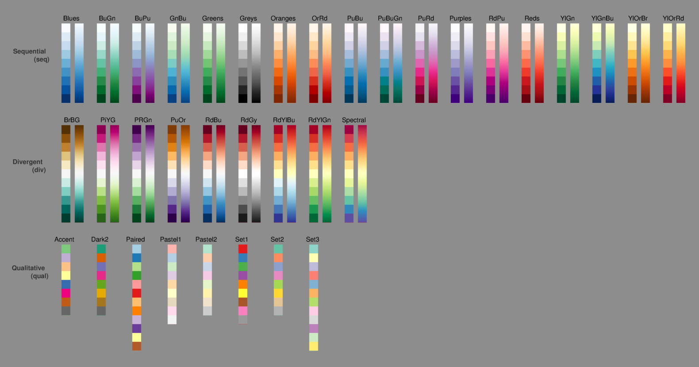

[][fex]

cbrewer2
========

This package makes Cynthia Brewer's
[ColorBrewer schemes](http://colorbrewer2.org/)
available in MATLAB, with a user-friendly interface.

Schemes can be interpolated to include more colours.
By default, this is done using cubic interpolation in the almost-perceptually
uniform CIELAB colour space to prevent inflection points arising and distorting
the scheme.

Requirements
------------

To interpolate the colour schemes in CIELAB space, the FEX package
[colorspace](https://www.mathworks.com/matlabcentral/fileexchange/28790-colorspace-transformations)
is required.

Samples
-------

The palettes available are shown in the image below.
Each colour scheme is shown with its maximum number of colours, along with an
interpolated colormap generated from the scheme.

Note that qualitative type colour schemes are never interpolated.

Licensing
---------

Copyright (c) 2016 Scott Lowe

Licensed under the Apache License, Version 2.0 (the "License");
you may not use this file except in compliance with the License.
You may obtain a copy of the License at

http://www.apache.org/licenses/LICENSE-2.0

Unless required by applicable law or agreed to in writing, software
distributed under the License is distributed on an "AS IS" BASIS,
WITHOUT WARRANTIES OR CONDITIONS OF ANY KIND, either express or implied.
See the License for the specific language governing permissions and
limitations under the License.

The color palettes provided as part of this package are the ColorBrewer Color
Schemes, which are available under the following license.

Copyright (c) 2002 Cynthia Brewer, Mark Harrower, and The Pennsylvania State
University.

Licensed under the Apache License, Version 2.0 (the "License"); you may not
use this file except in compliance with the License. You may obtain a copy of
the License at

http://www.apache.org/licenses/LICENSE-2.0

Unless required by applicable law or agreed to in writing, software
distributed under the License is distributed on an "AS IS" BASIS, WITHOUT
WARRANTIES OR CONDITIONS OF ANY KIND, either express or implied. See the
License for the specific language governing permissions and limitations under
the License.

Redistribution and use in source and binary forms, with or without
modification, are permitted provided that the following conditions are met:

1. Redistributions as source code must retain the above copyright notice, this
list of conditions and the following disclaimer.

2. The end-user documentation included with the redistribution, if any, must
include the following acknowledgment: "This product includes color
specifications and designs developed by Cynthia Brewer
(http://colorbrewer.org/)." Alternately, this acknowledgment may appear in the
software itself, if and wherever such third-party acknowledgments normally
appear.

4. The name "ColorBrewer" must not be used to endorse or promote products
derived from this software without prior written permission. For written
permission, please contact Cynthia Brewer at cbrewer@psu.edu.

5. Products derived from this software may not be called "ColorBrewer", nor
may "ColorBrewer" appear in their name, without prior written permission of
Cynthia Brewer.

  [fex]: http://mathworks.com/matlabcentral/fileexchange/58350-scottclowe-cbrewer2
